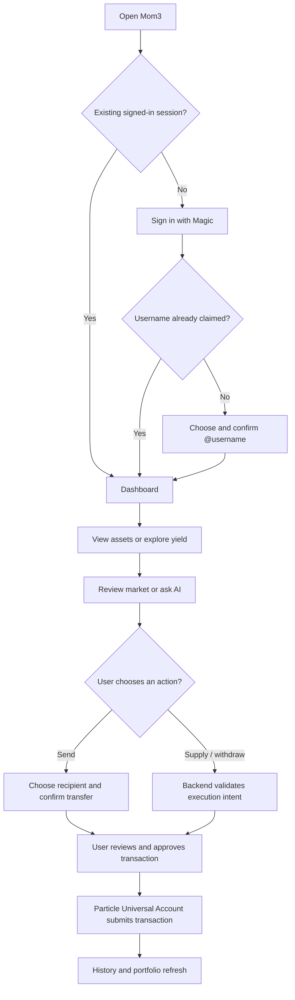
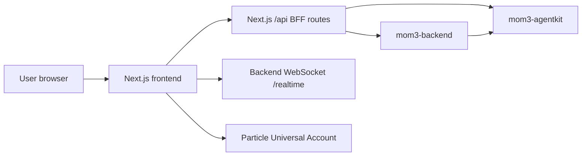

# Mom3 Application Guide

Mom3 is a self-custody wallet and yield-discovery application. It helps users sign in, create an `@username`, view a Universal Account portfolio, discover yield markets, receive AI-assisted analysis, and review a transaction before it is submitted.

> **Safety model:** AI analyzes, the backend validates policy, and the user approves the transaction. Mom3 is not an autonomous trading bot and does not store a user's private key.

## Audience

- **Users and demo reviewers:** understand the product and its main flows.
- **QA:** verify screens and their expected results.
- **Developers:** use [README.md](../README.md) for local setup, [endpoints.md](endpoints.md) for BFF routes, and [PRODUCTION_READINESS.md](PRODUCTION_READINESS.md) for release operations.

## Main capabilities

| Capability | User outcome | Route |
| --- | --- | --- |
| Sign in | Start a Magic wallet session. | `/login` |
| Username | Claim a unique `@username` for identity and recipient lookup. | `/claim-username` |
| Dashboard | See balances, activity summary, and earning opportunities. | `/dashboard` |
| Assets | Inspect portfolio assets and yield positions. | `/assets` |
| Earn | Discover and inspect yield markets. | `/explore` |
| AI | Ask for market or portfolio guidance. | `/agent`, `/ai`, `/ai/strategy` |
| Transactions | Deposit, convert, or send supported assets. | `/deposit`, `/convert`, `/send` |
| History | Review pending, successful, and failed activity. | `/history` |
| Profile | View identity and account controls. | `/profile` |

## User journey

## Getting started

1. Open Mom3 and sign in using the available Magic authentication method.
2. New users claim an `@username` with 3–20 letters, numbers, or underscores. The suggested default can be edited before confirmation.
3. Open **Dashboard** to view account information and earning opportunities.
4. Use **Deposit** if the Universal Account needs funds.
5. Open **Earn** to compare supported markets, or use **AI** for guidance.
6. Confirm the destination, asset, network, and amount before any transaction.
7. Open **History** to review the outcome.

## Screen reference

### Authentication and identity

| Screen | Expected behavior |
| --- | --- |
| `/` | Brief splash screen; redirects to Login without a session, otherwise Dashboard. |
| `/login` | Starts the Magic authentication flow. |
| `/claim-username` | Creates a unique username associated with the owner address. Input is normalized to lowercase and accepts letters, numbers, and underscores. |
| `/profile` | Shows account identity, username, wallet details, and account actions. |

### Portfolio and earning

| Screen | Expected behavior |
| --- | --- |
| `/dashboard` | Summary of balances, activity, and highlighted markets. |
| `/assets` | List of assets held by the Universal Account. |
| `/assets/[symbol]` | Detail view for an individual token. |
| `/assets/positions/[id]` | Detail view for a yield position. |
| `/explore` | Yield-market discovery catalog; discovery can be broader than the executable set. |
| `/explore/[id]` | Market detail, including available APY and market context. |
| `/agent`, `/ai`, `/ai/strategy` | Conversational and strategy views powered by the AI service when available. |

### Transactions and history

| Screen | Expected behavior |
| --- | --- |
| `/deposit` | Funding flow for the Universal Account. |
| `/convert` | Conversion flow for supported assets. |
| `/send` | Selects asset, amount, and recipient; a recipient may be resolved from a username. |
| `/send/confirm` | Shows final payment details before approval. |
| `/history` | Lists transaction activity. |
| `/history/[id]` | Shows an individual transaction record. |

## How execution is protected

1. The user selects a market and enters an amount.
2. Mom3 requests an execution intent from the backend.
3. The backend checks the requested action, supported chain, approved receiver, amount, and allowlisted market.
4. The frontend verifies returned metadata before constructing the Universal Account request.
5. Particle Universal Account presents the transaction for user approval and submits it only after approval.

Only entries marked executable are eligible for execution. A market visible in **Earn** is not automatically executable.

## Service boundaries

- **Frontend:** interface, local interaction state, and transaction review.
- **Next.js BFF:** server-side proxy that keeps server-only configuration out of the browser.
- **Backend:** policy validation and execution-intent creation.
- **AgentKit:** market intelligence and unsigned AI recommendations; it does not sign or broadcast transactions.
- **Particle Universal Account:** account and transaction execution experience.

## Important states

| State | Meaning | Next action |
| --- | --- | --- |
| Loading | Wallet, account, market, or history data is being loaded. | Wait for the screen to finish loading. |
| Username unavailable | The selected username is invalid or registered. | Choose another valid username. |
| No executable market | The market is informational but cannot be executed by Mom3. | Use it for research or choose another market. |
| AI unavailable | Backend or AgentKit cannot be reached. | Retry later; wallet features may still work. |
| Transaction failed | The account, network, quote, or chain rejected the request. | Check funds, network, and amount before retrying. |
| Pending transaction | The request was submitted but is not finalized. | Wait, then refresh History. |

## Safety checklist

- Confirm the **asset**, **amount**, **chain**, and **recipient/receiver**.
- Do not approve a transaction you do not understand.
- Treat APY and AI output as informational, not guaranteed returns or financial advice.
- Ensure the Universal Account has sufficient balance for the action and applicable fees.
- Never share recovery credentials, private keys, or backend environment values. Mom3 should never request them.

## Troubleshooting

| Problem | First check |
| --- | --- |
| Login does not finish | Verify public Magic and Particle environment configuration. |
| Dashboard is empty | Confirm session, Universal Account initialization, and backend URL. |
| AI cannot answer | Check `MOM3_BACKEND_URL` and backend/AgentKit health. |
| Realtime does not update | Verify `NEXT_PUBLIC_MOM3_REALTIME_URL` and WebSocket upgrade support for `/realtime`. |
| Transaction cannot submit | Recheck market eligibility, selected chain, amount, and account balance. |
| Username cannot be claimed | Use 3–20 lowercase letters, numbers, or underscores, then choose a unique value. |

## Related technical documentation

- [Frontend setup and architecture](../README.md)
- [Frontend BFF endpoint guide](endpoints.md)
- [Particle gas sponsorship](particle-gas-sponsorship.md)
- [Production readiness runbook](PRODUCTION_READINESS.md)
